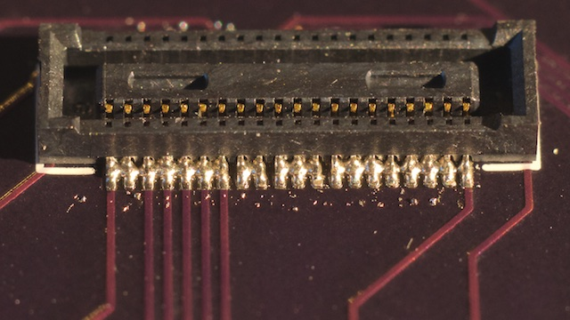

# pybd-breakout

This is a board to facilitate experimenting with the [pyboard-D](https://pybd.io). It provides an easy way to connect jumper wires to many of the pyboard's pins without having to solder anything to the pyboard itself.

Here is a picture of the PCB I ordered from [Osh Park](https://oshpark.com). Production and shipping to France took 20 days. FWIW I was very happy with the price (8.45 USD for three boards) and the quality.

I wasn't confident that I could easily solder the 0.4-mm-pitch WBUS connectors so I added extra WBUS footprints  on the back of the board, for training purposes:

The reference for the WBUS connectors is [Hirose DF40C-40DS-0.4V(51)](https://www.digikey.com/products/en?keywords=h11625ct-nd) (thanks to [alustig3](https://forum.micropython.org/viewtopic.php?f=20&t=6164) for figuring it out).

It's actually easy to solder the WBUS connectors using low-temperature solder paste such as [this one](https://www.amazon.fr/gp/product/B07B3WV5KN). I put a very small amount of paste on each of the four contact rows, then positioned the two connectors, then laid the board on a heating plate at 150&nbsp;°C. The solder melted after a minute or two. I precisely repositioned the connectors and let the board cool down.

Predictably, the results are ugly at this stage:

I then removed excess solder and bridges using solder wick and a soldering iron. In the picture below it looks nuch nicer (but note the remaining bridge between `Y11` and `A3V3`, which I corrected later):

At this stage I thoroughly tested the connector pins for bridges/shorts, using a multimeter under a binocular microscope.

I then added female pin headers

And the pyboard itself:

